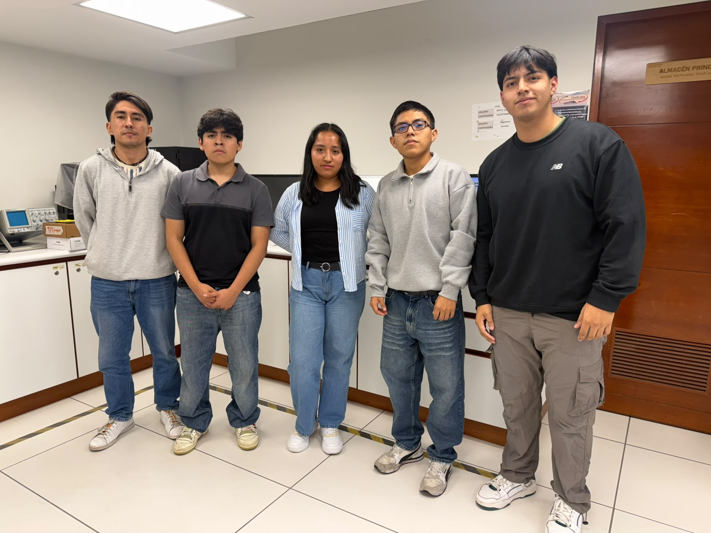

# Equipo XIV - Fundamentos de Diseño
### Carrera de Ingeniería Ambiental / Informática / Industrial  
**Universidad Peruana Cayetano Heredia**

---

## 🌍 Descripción del Equipo 
Somos el **Equipo 14** del curso **Fundamentos de Diseño 2026-2**, conformado por estudiantes de la carrera de Ingeniería Ambiental / Informática / Industrial.  
Nuestro objetivo es aplicar la metodología de diseño para generar soluciones innovadoras con impacto social, tecnológico y ambiental.  

Nos interesa trabajar en los siguientes **Objetivos de Desarrollo Sostenible (ODS):**   
- ODS 9: Industria, Innovación e Infraestructura  
- ODS 11: Vida y Ecosistemas sostenibles 
- ODS 15: Acción por el Clima  

---

## 📸 Fotografía del Equipo  

  <em>Figura 1. Fotografía del equipo XIV</em>

---

## 👥 Integrantes del Equipo  

| Foto | Nombre | Rol | Intereses |
|------|--------|-----|-----------|
|  | **FERNANDEZ GAMONAL FERNANDO MATÍAS** | Líder del equipo | Innovación social, sostenibilidad |
|  | **HIDALGO CASTILLO CARLOS ANTONIO** | Encargado/a de documentación| Comunicación científica, redacción técnica |
|  | **HUARCAYA CHIPANA HECTOR RAUL** | Diseñador/a | Diseño de prototipos, creatividad aplicada |
|  | **TADEO ARQUINIGO LESLYE TATIANA** |  Responsable de investigación  | Gestión ambiental, desarrollo comunitario |
|  | **MARQUIÑO NIEVA JORDAN ADRIAN** | Programador/a - Modelador/a | Programación, análisis de datos, simulación |

---

## 📌 Resumen Final  
En conclusión, este trabajo atravez de los ODS 9, 11 y 15 busca promover la innovación y el desarrollo sostenible, creando comunidades más responsables y protegiendo nuestros ecosistemas y recursos naturales para mejorar la calidad de vida..  
